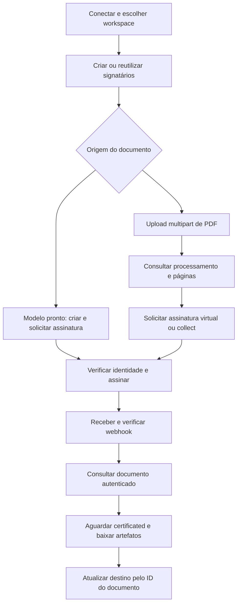

# Assinafy + Pluga

Integre o ciclo de documentos da Assinafy com **Pluga Webhooks + HTTP Request**. O kit inclui receitas JSON, cliente TypeScript sem dependências de execução, API key, OAuth2 com PKCE, configuração de endpoints e verificação de webhooks assinados.

As receitas são instruções para configurar requisições manualmente. O código TypeScript executa no seu servidor ou processo Node.js; colar uma receita não instala esse código dentro da Pluga. Um conector nativo e a listagem no programa de parceiros dependem da aprovação da Pluga.

## Instalação e ambientes

Use **Node.js 24 LTS**. Node.js 22 LTS também é suportado. TypeScript 7 é uma dependência de desenvolvimento; TypeScript não possui uma política de LTS equivalente à do Node.js.

```sh
npm ci
npm run check
npm run contract
```

| Ambiente | API | Aplicação |
|---|---|---|
| Sandbox | `https://sandbox.assinafy.com.br/v1` | `https://app-sandbox.assinafy.com.br` |
| Produção | `https://api.assinafy.com.br/v1` | `https://app.assinafy.com.br` |

Credenciais e registros pertencem ao ambiente escolhido. Forneça os valores por variáveis de ambiente ou arquivo ignorado com permissões restritas. Os scripts exigem `ASSINAFY_ENVIRONMENT` explícito; o construtor mantém produção como padrão para clientes existentes.

```js
import { AssinafyClient, runAction, loadOptions } from './dist/index.js';

const client = new AssinafyClient({
  type: 'api_key',
  apiKey: process.env.ASSINAFY_API_KEY,
  accountId: process.env.ASSINAFY_ACCOUNT_ID,
  environment: 'sandbox',
});
await client.workspace();
```

Cada cliente confirma acesso ao workspace em `GET /accounts`. O ID selecionado não reduz os privilégios da API key. Para atuar em workspaces de clientes, use OAuth2.

## Fluxo completo de documento



### 1. Conecte a Pluga

Selecione **HTTP Request → Enviar uma mensagem via HTTP Request → Preencher campos com um JSON**. Esse modo preserva listas e objetos. Configure os headers:

```json
{
  "X-Api-Key": "<ASSINAFY_API_KEY>",
  "Accept": "application/json",
  "Content-Type": "application/json"
}
```

Para OAuth, substitua `X-Api-Key` por `Authorization: Bearer <ASSINAFY_ACCESS_TOKEN>`. A conexão responsável por OAuth deve executar consentimento e renovação; um header colado manualmente expira. Confira o suporte da modalidade Pluga contratada.

Consulte `GET /accounts` e copie `data[].id` do workspace escolhido. A API responde com `{ "status": 200, "message": "", "data": ... }`. O cliente retorna `data`; a Pluga pode acrescentar outra camada. Selecione os campos pelo resultado do teste da ação.

### 2. Crie ou reutilize os signatários

Consulte `GET /accounts/ACCOUNT_ID/signers` antes de criar contatos novamente. Para `POST /accounts/ACCOUNT_ID/signers`:

```json
{
  "full_name": "Signatário de exemplo",
  "email": "signer@example.com",
  "government_id": "390.533.447-05"
}
```

Os dados são fictícios. Use destinatários autorizados. `government_id` é opcional para Email/WhatsApp; a API aceita CPF ou CNPJ, inclusive CNPJ alfanumérico, e normaliza a formatação. WhatsApp usa `whatsapp_phone_number` em E.164. Criar o contato não envia convite.

```js
const signer = await runAction('create_signer', client, {
  body: { full_name: 'Signatário de exemplo', email: 'signer@example.com' },
});
// Guarde signer.id na operação de origem.
```

### 3. Prepare o documento

**Modelo existente:** consulte `GET /accounts/ACCOUNT_ID/templates`, escolha um modelo `ready` e mapeie cada papel não-editor exatamente uma vez. Preencha campos do editor pelos IDs do próprio modelo.

```js
const roles = await loadOptions('template_roles', client, templateId);
const sent = await runAction('create_document_from_template', client, {
  template_id: templateId,
  body: {
    name: 'Contrato de exemplo',
    signers: [{ id: signer.id, role_id: roles[0].value, verification_method: 'Email' }],
  },
});
```

**Essa chamada cria e envia o documento para assinatura.** O exemplo pressupõe um modelo com um único papel e nenhum campo do editor obrigatório. Mapeie todos os papéis e acrescente `editor_fields` quando necessário.

**PDF existente:** no cliente local, envie bytes por multipart. O transporte define o boundary; não informe `Content-Type` manualmente.

```js
const form = new FormData();
form.set('file', new Blob([pdfBytes], { type: 'application/pdf' }), 'contrato.pdf');
const uploaded = await client.upload(await client.accountPath('/documents'), form);
const document = await runAction('get_document', client, { document_id: uploaded.id });
```

Acompanhe `uploaded → metadata_processing → metadata_ready`. `virtual` aceita esses três estados e aguarda processamento; `collect` exige `metadata_ready`, páginas do documento e campos posicionados em pixels do raster a 150 DPI. Consulte novamente após um intervalo e trate `document_processing_failed` como falha.

Upload/download binários estão disponíveis no cliente local. O caminho demonstrado na Pluga começa com documento/modelo já disponível na Assinafy; confirme o suporte equivalente a multipart/binário no construtor da Pluga.

### 4. Solicite a assinatura

Para documento existente, `POST /documents/DOCUMENT_ID/assignments`:

```json
{
  "method": "virtual",
  "signers": [{
    "id": "SIGNER_ID",
    "verification_method": "Email",
    "notification_methods": ["Email"],
    "step": 1
  }],
  "message": "Confira o documento antes de assinar.",
  "copy_receivers": ["COPY_RECEIVER_ID"]
}
```

`message`, `copy_receivers`, `expires_at` e `step` são opcionais. Expiração exige ISO 8601 com fuso, pelo menos uma hora à frente. Informe `step` para todos os signatários ou nenhum, com sequência contínua a partir de 1. Signatários do mesmo passo assinam em paralelo. O cliente bloqueia documentos com assignment existente para evitar novo convite.

| Verificação | Notificação | Requisitos |
|---|---|---|
| `Email` | `Email` | Contato com e-mail |
| `Whatsapp` | `Whatsapp` | Número E.164; recurso do plano e créditos |
| `DigitalCertificate` | `Email` ou `Whatsapp` | CPF/CNPJ, recurso de certificado digital, ICP-Brasil A1/A3; um signatário por passo |

`notification_methods` aceita exatamente um canal. Se um lado for omitido, a API infere o outro; se ambos forem omitidos, usa Email. A1/A3 são certificados usados pelo signatário via Web PKI; o código enviado à API é `DigitalCertificate`. Consulte os endpoints de estimativa de custo da [API](https://api.assinafy.com.br/v1/docs) antes de envios que consumam créditos.

### 5. Receba e verifique os eventos

Crie **Webhooks → Notificação recebida** na Pluga e copie a URL privada. Consulte `GET /accounts/ACCOUNT_ID/webhooks/endpoints` e cadastre um endpoint próprio com `POST` no mesmo caminho:

```json
{
  "name": "Pluga",
  "url": "https://receiver.example.com/substitua-pela-url-da-pluga",
  "email": "ops@example.com",
  "events": ["document_ready", "signer_signed_document", "signer_rejected_document", "document_processing_failed"],
  "is_active": true,
  "signing_enabled": true
}
```

Há um endpoint no plano gratuito e até três nos planos pagos. Cada um possui URL, eventos e assinatura próprios. Use uma URL distinta para cada integração. `/webhooks/subscriptions` continua funcionando e atua no endpoint mais antigo; os helpers legados preservam uma configuração existente diferente.

Com assinatura habilitada, o receptor deve acessar o corpo original e os headers `webhook-id`, `webhook-timestamp` e `webhook-signature`. Obtenha o segredo por API key em `GET /accounts/ACCOUNT_ID/webhooks/endpoints/ENDPOINT_ID/secret`; essa operação não aceita OAuth. Guarde o segredo somente no receptor.

```js
import { verifyWebhookSignature, normalizeEvent } from './dist/index.js';

const rawBody = await request.text(); // Antes de qualquer parser JSON.
await verifyWebhookSignature(rawBody, request.headers, webhookSecret);
const event = normalizeEvent(JSON.parse(rawBody), accountId, request.headers.get('webhook-id'));
```

O helper verifica HMAC-SHA256 usando Web Crypto, aceita entradas `v1` do padrão Standard Webhooks e rejeita timestamps fora de cinco minutos. Não serialize novamente o JSON antes de verificar. `normalizeEvent` filtra workspace e calcula uma chave estável; armazene-a persistentemente antes de efeitos duplicáveis. O helper não mantém esse armazenamento.

Se a modalidade Pluga não permitir verificar corpo/headers, use seu receptor para verificar antes de encaminhar os campos necessários à Pluga. Habilitar assinatura no envio não implementa a verificação no destino. Mantenha a URL privada e confirme o documento por GET autenticado.

O ID superior `id` identifica a atividade; `object.id` identifica o documento. O [exemplo fictício](examples/document-ready.json) mostra o envelope. `document_ready` indica que todos assinaram; `signer_signed_document` indica uma assinatura individual. Eventos podem se repetir e chegar fora de ordem. Cada endpoint recebe independentemente, com até duas tentativas e intervalo de três segundos. Consulte entregas em `GET /accounts/ACCOUNT_ID/webhooks`.

### 6. Confirme o estado e obtenha o arquivo

```js
const current = await runAction('get_document', client, { document_id: event.document_id });
if (current.status === 'certificated') {
  const pdf = await client.binary(`/documents/${current.id}/download/certificated`);
  // Salve os bytes no destino autorizado.
}
```

`ready` pode aparecer antes de `certificated`. Consulte estado e artefatos até estarem disponíveis. Os artefatos incluem `original`, `thumbnail`, `certificated`, `certificate-page`, `bundle` e, quando aplicável, `pades`, que preserva as assinaturas ICP-Brasil dos signatários. URLs de artefatos exigem autenticação; não são links públicos.

Downloads têm limite padrão de 50 MiB. Redirects externos exigem origens HTTPS em `trustedDownloadOrigins` e recebem a requisição sem API key/token. Esse parâmetro é configuração do deployment, sem controle pelo usuário final.

### 7. Atualize o destino e recupere falhas

Associe documento e registro de origem por ID. Atualize a linha, negócio ou card existente pelo estado consultado. Reserve atomicamente a chave do evento em armazenamento persistente antes de ações duplicáveis. Para criar documentos, reserve o ID da operação de origem e persista o ID retornado. Uma consulta seguida de POST não impede execuções simultâneas.

| Situação | Tratamento |
|---|---|
| 400 / 422 | Corrigir campos, papéis, canais ou geometria |
| 401 | Reconectar; OAuth exige renovação controlada |
| 403 | Conferir workspace, escopos e recursos do plano |
| 429 | Respeitar `Retry-After` |
| Timeout / 5xx após escrita | Conferir se o efeito ocorreu antes de replay |
| Evento repetido | Usar reserva persistente e consultar estado atual |

O cliente não repete requisições automaticamente. `IntegrationError` informa `code`, `httpStatus`, `safeToRetry`, `outcomeUnknown` e `retryAfterSeconds`, sem expor corpos upstream. Resultado desconhecido de escrita exige reconciliação.

## OAuth2 para contas de clientes

Registre a aplicação em **Integrações → Apps OAuth**. Use confidential no servidor que guarda segredo ou public em dispositivo/browser. Cadastre a URI HTTPS exata. O fluxo OAuth 2.1 authorization code exige PKCE:

```js
import { createOAuthAuthorization, exchangeOAuthCode, refreshOAuthToken, revokeOAuthToken } from './dist/index.js';

const application = { clientId, clientSecret, environment: 'production' };
const session = await createOAuthAuthorization({
  ...application,
  redirectUri: 'https://app.example.com/oauth/callback',
  scopes: ['account:read', 'documents:read', 'documents:write', 'templates:read'],
});
// Guarde session no servidor, vinculada à sessão do usuário; redirecione para session.url.
const tokens = await exchangeOAuthCode(session, callbackUrl, clientSecret);
// Consuma a sessão uma vez e guarde tokens com acesso restrito.
```

O helper valida callback, `state`, `iss` e PKCE antes de trocar o código. Tokens são JSON simples, fora de `data`. Um token pertence a um workspace. Consulte `GET /accounts` com Bearer e guarde `data[0].id` junto à conexão; leia os escopos recebidos em `scope`.

Access tokens duram uma hora. Para receber refresh token, registre e solicite `offline_access`. Execute um refresh por vez por conexão; cada refresh invalida o anterior. Persista o novo token antes de usá-lo. Timeout não autoriza repetir o token antigo. Ao desconectar, chame `revokeOAuthToken(application, token)` com o client que o emitiu.

| Operação | Escopos usados |
|---|---|
| Workspace, inscrição e lista de endpoints | `account:read` |
| Documentos, contatos, campos, catálogo/histórico de eventos | `documents:read` |
| Criar documento/signatário e solicitar assinatura | `documents:write` e leitura para os preflights |
| Modelos e papéis | `templates:read` |
| Criar/alterar/excluir endpoints | `webhooks:write` e leitura usada no setup |
| Renovação em segundo plano | `offline_access` durante consentimento |

Seu servidor mantém sessões, armazenamento de tokens e exclusão mútua no refresh. Esses helpers não instalam um conector nativo Pluga nem implementam login OIDC. Um [Cloudflare Quick Tunnel](https://developers.cloudflare.com/cloudflare-one/networks/connectors/cloudflare-tunnel/do-more-with-tunnels/trycloudflare/) fornece callback HTTPS temporário para desenvolvimento; use endereço estável em produção.

## Referência e operação

- [Todas as funções e payloads](docs/API.md)
- [Configuração manual na Pluga](docs/SETUP.md)
- [Execução dos testes](docs/TESTING.md)
- [Guia público](public-guide/README.md)
- [Receitas JSON](recipes/requests.json)
- [Documentação oficial](https://api.assinafy.com.br/v1/docs)

`npm run smoke` faz somente leituras. Forneça exatamente uma de `ASSINAFY_API_KEY` ou `ASSINAFY_ACCESS_TOKEN`, mais `ASSINAFY_ACCOUNT_ID` e `ASSINAFY_ENVIRONMENT`. `ASSINAFY_DOCUMENT_ID` habilita consulta de documento específico. O script imprime apenas um resumo.

Credenciais, artefatos e arquivos locais `AGENTS.md`/`CLAUDE.md` são ignorados pelo Git. Exemplos publicados usam domínios reservados para dados fictícios. Nunca coloque segredos em URLs, eventos, receitas compartilhadas ou screenshots.
