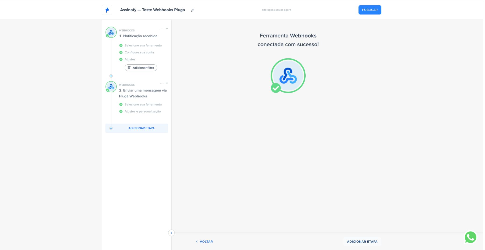
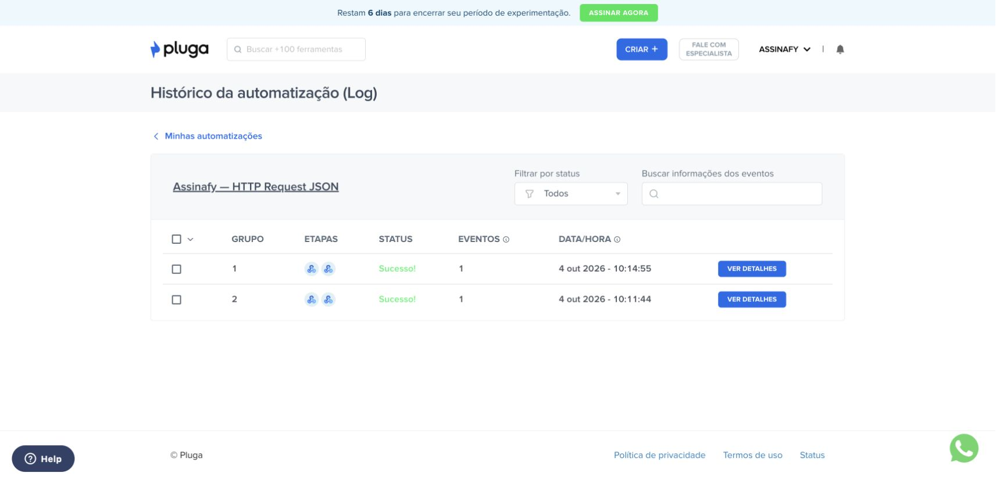

# Como integrar a Assinafy com a Pluga


Receba eventos de assinatura da Assinafy na Pluga e use a API para consultar documentos, criar signatários e enviar documentos a partir de modelos. Este guia usa **Pluga Webhooks + HTTP Request**, com chave de API e ID do workspace.

**Modalidade:** configuração manual via Webhooks. Candidatura ao programa de parceiros enviada em 4 de outubro de 2026, aguardando avaliação da Pluga. Isso não equivale à aprovação ou à disponibilidade de um conector nativo da Assinafy na Pluga.

## Antes de começar

- Uma conta na [Assinafy](https://app.assinafy.com.br), uma chave de API e acesso ao workspace escolhido.
- Uma conta na [Pluga](https://manage.pluga.co) com os recursos necessários. **HTTP Request é um recurso Premium**; confirme as condições do seu plano antes de ativar o fluxo.
- Para enviar assinaturas, um documento já enviado à Assinafy ou um modelo pronto, além dos signatários e papéis correspondentes.
- Um destinatário sob seu controle para o teste. Os exemplos deste guia usam dados fictícios.

O fluxo não exige servidor adicional, cliente OAuth ou serviço de callback. Cada cliente informa sua própria chave na Pluga. O ID do workspace seleciona o destino; ele não restringe os demais privilégios da chave.

## 1. Identifique o workspace

Na Assinafy, crie ou selecione a chave nas configurações da conta. Na Pluga, configure uma requisição de teste:

| Campo | Valor |
|---|---|
| Método | `GET` |
| URL | `https://api.assinafy.com.br/v1/accounts` |
| Header | `X-Api-Key`: sua chave |
| Header | `Accept`: `application/json` |
| Basic Auth | Vazio |

Na resposta, encontre o workspace pelo nome e copie seu `id` em `data[]`. Nos exemplos abaixo, substitua `ACCOUNT_ID` por esse valor. Substitua os demais identificadores em maiúsculas pelos registros da sua conta; eles não são variáveis prontas da Pluga.

Insira a chave somente nos headers da conexão/requisição. Não use a chave na URL, no corpo de eventos ou em planilhas. O histórico da Pluga pode exibir headers em texto: limite o acesso às automações e não compartilhe screenshots ou logs que contenham a chave.

## 2. Crie o receptor na Pluga

1. Clique em **Criar automatização**.
2. Selecione **Webhooks → Notificação recebida** como origem.
3. Use **Conectar nova conta** para gerar a URL de recepção. Copie essa URL e mantenha-a privada.
4. Configure o modelo de dados usando o [evento fictício document_ready](examples/document-ready.json), ou capture um evento de teste da sua conta.
5. Adicione filtros para `account_id` igual ao seu workspace, `object.type` igual a `Document` e `event` igual a `document_ready`.



*Tela real da conexão usada no teste. A captura mostra uma ação Webhooks simples; para ações com listas de signatários, use HTTP Request no modo JSON conforme o passo 5.*

O evento `document_ready` informa que todas as assinaturas foram concluídas. Para acompanhar cada assinatura individual, use `signer_signed_document` em um fluxo separado.

## 3. Configure o webhook na Assinafy

Na área de Webhooks do workspace, informe a URL privada gerada pela Pluga, selecione os eventos desejados e ative a inscrição. Se preferir configurar pela API, siga esta sequência, uma única vez na instalação:

1. Consulte `GET /accounts/ACCOUNT_ID/webhooks/subscriptions`.
2. Se já existir uma inscrição, confirme com o responsável como preservá-la: o path legado atua no endpoint mais antigo; há um endpoint gratuito ou até três nos planos pagos. Para uma integração adicional, use GET/POST /accounts/ACCOUNT_ID/webhooks/endpoints com uma URL própria. Não substitua a URL de outra integração. Para testes, use um workspace dedicado.
3. Consulte os nomes disponíveis em `GET /webhooks/event-types`.
4. Configure `PUT /accounts/ACCOUNT_ID/webhooks/subscriptions` com os headers `X-Api-Key`, `Accept: application/json` e `Content-Type: application/json` e este corpo:

```json
{
  "url": "https://example.com/substitua-pela-url-privada-da-pluga",
  "email": "operacoes@example.com",
  "events": ["document_ready", "signer_signed_document"],
  "is_active": true
}
```

Troque também o e-mail pelo responsável por receber os avisos da inscrição. Não inclua essa requisição de configuração em cada execução da automação.

### Modelo de evento

```json
{
  "id": 10001,
  "event": "document_ready",
  "account_id": "workspace_example",
  "created_at": 1791028800,
  "message": "Evento fictício para configuração do modelo na Pluga",
  "object": {
    "type": "Document",
    "id": "document_example",
    "account_id": "workspace_example",
    "name": "Teste Pluga.pdf",
    "status": "ready"
  },
  "payload": {},
  "origin": null,
  "subject": {"type": "Account", "id": "workspace_example"}
}
```

Use **`object.id`** como ID do documento. O `id` superior identifica a atividade. Campos adicionais podem aparecer. Eventos reais podem conter dados pessoais em `subject`; mapeie apenas os campos necessários para o destino.

## 4. Confirme o estado na API antes de atualizar o destino

Adicione uma consulta HTTP autenticada:

```text
GET https://api.assinafy.com.br/v1/documents/DOCUMENT_ID?expand=assignment
X-Api-Key: SUA_CHAVE
Accept: application/json
```

No campo da URL, insira o **campo dinâmico `object.id`** do gatilho no lugar de `DOCUMENT_ID`. Confirme que o `data.account_id` retornado é o seu workspace e use o `data.status` consultado para atualizar o destino.

O envelope da API guarda o registro em `data`. Algumas ações da Pluga adicionam outro nível `data` ao resultado: escolha os campos a partir da resposta que o teste da ação efetivamente mostrar.

A Assinafy suporta assinatura Standard Webhooks por endpoint (signing_enabled). A URL privada do receptor e o filtro de workspace não verificam essa assinatura. Um receptor que tenha acesso ao corpo original e aos headers pode verificar HMAC-SHA256 antes de encaminhar o evento à Pluga. A consulta autenticada confirma o documento e seu estado atual. Não autorize operações usando apenas os dados recebidos pelo webhook.

`document_ready` pode chegar antes de o PDF certificado estar disponível. Para baixar o arquivo final, aguarde o estado `certificated` e a disponibilidade do artefato. Os endpoints de download exigem autenticação; não são links públicos para compartilhar.

### Três possibilidades de destino

- **Google Sheets:** inserir/atualizar uma linha com o ID do documento, nome e estado consultado. Use uma chave estável por documento para encontrar a mesma linha.
- **Pipedrive:** atualizar o negócio associado ao documento quando todas as assinaturas forem concluídas. Mantenha a associação entre os dois IDs no seu processo.
- **Trello:** mover o card associado ao documento para a lista de contratos assinados após confirmar o estado na API.

Esses são exemplos de uso propostos. Os testes descritos abaixo validaram o trecho Assinafy ↔ Pluga; as ações nas contas desses três destinos precisam ser configuradas e testadas pelo cliente.

## 5. Envie documentos a partir da Pluga

Para chamadas com listas como `signers`, selecione **HTTP Request → Enviar uma mensagem via HTTP Request**. Em **Tipo de preenchimento dos campos da requisição**, escolha **Preencher campos com um JSON**.

Configure **Cabeçalhos (JSON)**:

```json
{
  "X-Api-Key": "SUA_CHAVE",
  "Accept": "application/json",
  "Content-Type": "application/json"
}
```

Cole o objeto inteiro em **Corpo da requisição (JSON)**. Não cole uma lista como texto dentro de um campo simples: `signers` deve permanecer um array de objetos.

### Criar signatário

```text
POST https://api.assinafy.com.br/v1/accounts/ACCOUNT_ID/signers
```

```json
{
  "full_name": "Signatário de teste",
  "email": "signatario@example.com"
}
```

Substitua o e-mail por um destinatário autorizado. Guarde o `data.id` retornado. Criar um signatário não envia um convite; se ele já existir, reutilize seu ID após consultar a lista de signatários do workspace.

### Criar e enviar documento de um modelo

Consulte `GET /accounts/ACCOUNT_ID/templates`, escolha um modelo pronto e identifique seus papéis de assinatura. Cada papel não-editor deve receber um signatário.

```text
POST https://api.assinafy.com.br/v1/accounts/ACCOUNT_ID/templates/TEMPLATE_ID/documents
```

```json
{
  "name": "Contrato de teste",
  "signers": [
    {
      "id": "SIGNER_ID",
      "role_id": "ROLE_ID",
      "verification_method": "Email",
      "notification_methods": ["Email"]
    }
  ]
}
```

Se houver campos do editor no modelo, inclua `editor_fields: [{"field_id":"FIELD_ID","value":"VALOR"}]`. Remova essa propriedade quando não houver campos a preencher.

**A chamada cria o documento e inicia o fluxo de assinatura.** Confira destinatários e papéis no teste antes de ativar a automação.

### Solicitar assinatura de um documento existente

Primeiro consulte o documento com `expand=assignment`. Confirme workspace, estado compatível e ausência de uma solicitação existente.

```text
POST https://api.assinafy.com.br/v1/documents/DOCUMENT_ID/assignments
```

```json
{
  "method": "virtual",
  "signers": [
    {
      "id": "SIGNER_ID",
      "verification_method": "Email",
      "notification_methods": ["Email"]
    }
  ]
}
```

O modo `virtual` foi testado para documentos existentes. O envio por modelo foi testado com campo de assinatura posicionado no próprio modelo. O upload binário de PDF diretamente pela Pluga não está incluído neste caminho validado; prepare o documento/modelo na Assinafy antes da automação.

## 6. Evite efeitos duplicados

Eventos podem ser entregues novamente ou fora de ordem. O fluxo validado de recepção faz uma consulta GET; repetir essa leitura não cria documentos nem convites.

- Para atualizar registros existentes, use o ID do documento como chave de correspondência no destino e consulte sempre o estado atual. Configure e teste a ação de atualização, em vez de acrescentar um novo registro a cada entrega.
- Para ações que não podem se repetir, registre `account_id + ":" + id` do evento em armazenamento persistente, com reserva atômica antes da ação e estados de processamento/conclusão. Marque a conclusão somente depois de confirmar o resultado; resultado incerto exige reconciliação.
- Para criações iniciadas em CRM/planilha, use o ID único da operação de origem, persista o ID do documento resultante e impeça duas execuções simultâneas da mesma operação. Uma consulta seguida de criação sem controle de concorrência não garante isso.
- Não presuma deduplicação automática da Pluga ou suporte a um header `Idempotency-Key` da Assinafy. Essas garantias não foram demonstradas neste fluxo. Se o produtor/destino não oferecer o controle necessário, mantenha as criações sob execução supervisionada até implementá-lo.
- Em timeout ou HTTP 5xx depois de uma criação/envio, verifique primeiro se o documento ou convite já existe. Não repita o POST automaticamente nem use o reprocessamento em massa antes dessa conferência.

Esse controle persistente depende do produtor/destino escolhido e não é instalado por este guia. A publicação do tutorial não ativa automações de escrita na conta do cliente.

## 7. Teste antes de ativar

1. Use workspace e destinatário de teste.
2. Confirme HTTP 200 na consulta autenticada e o workspace correto.
3. Faça um envio controlado, conclua a assinatura e confira o documento na Assinafy.
4. Confira a entrega em `GET /accounts/ACCOUNT_ID/webhooks` (`delivered` e `http_status`).
5. Confira o histórico da automação Pluga e o resultado da ação de destino. Um HTTP 200 no receptor não comprova que todas as etapas seguintes terminaram.
6. Repita o mesmo evento e confirme o comportamento esperado para duplicatas antes de ativar efeitos de escrita.



**Validação de 4 de outubro de 2026:** os fluxos de documento existente → solicitação de assinatura e modelo → criação/envio terminaram com documentos assinados e certificados. Foram confirmadas 13 entregas reais/replay de webhook com HTTP 200, 15 execuções bem-sucedidas do receptor (incluindo dois testes iniciais), duas ações HTTP JSON e 53 testes locais.

PDFs e ZIPs finais foram baixados e conferidos diretamente pela API, fora da Pluga. WhatsApp, certificado digital do signatário, recusa e múltiplos signatários não foram exercitados nesses testes de produção. Os fluxos de escrita de teste foram desativados ao concluir.

## Erros comuns

| Resposta | O que conferir |
|---|---|
| 400 / 422 | Campos obrigatórios, papéis do modelo e arrays JSON |
| 401 | Chave de API e header `X-Api-Key` |
| 403 | Permissões da conta e workspace |
| 429 | Limite de requisições e `Retry-After` |
| Timeout / 5xx após escrita | Resultado já criado antes de repetir a operação |

## Referências e arquivos

- [Documentação da API Assinafy](https://api.assinafy.com.br/v1/docs)
- [Receitas de requisição](examples/requests.json) — ficha de configuração manual, não um arquivo de importação da Pluga.
- [JSON fictício do webhook](examples/document-ready.json)
- [Logo SVG](assets/assinafy-logo.svg) e [logo PNG](assets/assinafy-logo.png)
- [Pluga Webhooks: configuração oficial](https://pluga.zendesk.com/hc/pt-br/articles/360007678434-Pluga-Webhooks-Como-criar-automatiza%C3%A7%C3%B5es-com-ferramentas-n%C3%A3o-integradas-%C3%A0-Pluga)
- [HTTP Request na Pluga](https://pluga.co/ferramentas/http-request/integracao/)
- Destinos propostos: [Google Sheets](https://pluga.co/ferramentas/google-sheets/integracao/), [Pipedrive](https://pluga.co/ferramentas/pipedrive/integracao/) e [Trello](https://pluga.co/ferramentas/trello/integracao/).

Guia mantido pela Assinafy. Atualizado em 9 de outubro de 2026.
